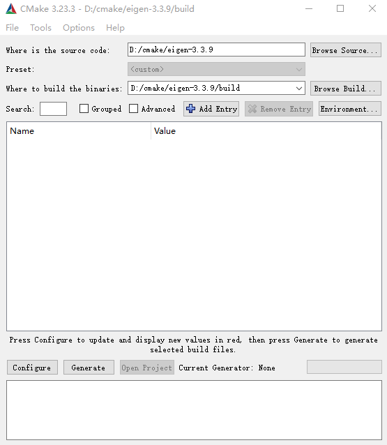

# CMake的安装

在[CMake](https://cmake.org/)官网下载安装cmake。如，写文时最新的版本为3.24，下载windows版安装文件cmake-3.24.0-windows-x86_64.msi，下载完毕后双击安装即可，记得选择添加到PATH。

# OpenCV库的引入

在[opencv](https://github.com/opencv/opencv)的github网页下载预编译好的opencv，windows提供了一个自解压exe文件，双击打开即可。

# Eigen库的引入

在[eigen](https://eigen.tuxfamily.org/index.php?title=Main_Page)官网下载源代码，解压，复制解压路径（比如YOURPATH="D:\coding\cmake\eigen-3.3.9），在powershell中执行

```shell
cd YOURPATH
mkdir build
cmake-gui .
```



在cmake GUI中设置build路径，然后Configure编译器为MinGW或者MSVC，Generate.

接下来回到powershell

```shell
cd build
cmake --build . #这行其实不用输入，因为eigen已经完成工作了
cmake --install . --prefix=./install
```

YOURPATH/build/install目录下就是安装完成的eigen库了，当然去掉--prefix可以安装到默认路径，修改prefix可以安装到项目文件中。

# CMakeLists的编写

新建一个Project文件夹（如Rasterizer)，将Eigen和opencv放到文件夹中，比如下图结构


（忽略3.3.9.txt和linux-build文件夹）

接下来修改cmakelists，如果你的IDE自动生成的话，你会看到类似于以下内容

```cmake
cmake_minimum_required(VERSION 3.16)
project(Rasterizer)

add_executable(Rasterizer main.cpp)
```

修改为

```cmake
cmake_minimum_required(VERSION 3.16)
project(Rasterizer)
if (CMAKE_SYSTEM_NAME MATCHES "Windows")
    #eigen package
    include_directories("3Party/eigen/include/eigen3")
    #opencv package
    find_package(OpenCV REQUIRED
            PATHS 3Party/opencv)
endif()
include_directories(${OpenCV_INCLUDE_DIRS})

add_executable(Rasterizer main.cpp)
target_link_libraries(Rasterizer ${OpenCV_LIBS})
message(${PROJECT_BINARY_DIR})
```

并且将opencv/x64/COMPILER/bin文件夹下的dll全部拷贝到项目生成二进制文件目录下。如不清楚在哪，就放到cmake-build-debug或者上面cmakelists运行后输出的目录下。

接下来试着跑一个HelloWorld

~~~cpp
#include <iostream>
#include <Eigen/Core>
#include <opencv2/core.hpp>

int main() {
    std::cout << "Hello World" << std::endl;
}
~~~

如果没有报错，则说明配置完成
