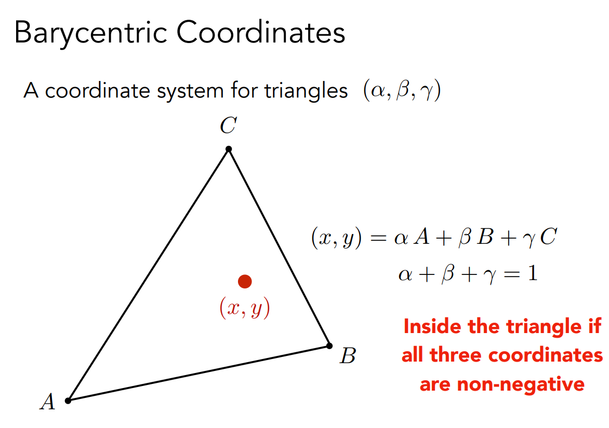

# 重心坐标

你可以在shell运行`git reset 715be9d4`并且注释掉CMakeLists最后一行`add_subdirectory(googletest)`来运行案例

友情链接：你可以在[GAMES101_Lecture_09](https://sites.cs.ucsb.edu/~lingqi/teaching/resources/GAMES101_Lecture_09.pdf)找到更多关于重心坐标的相关资料

# 什么是重心坐标



从GAMES101课件中，可以知道当点P(x,y)在三角形ABC内部时，有

$$
(x,y)=\alpha A+\beta B+\gamma C  \\
\alpha+\beta+\gamma=1 \\
\alpha>0,\beta>0,\gamma>0

$$

称为式(1)(2)(3)。

先看式（1），在三维空间中，如果点A,B,C能表示一个三角形，说明A,B,C不共线，则向量组$\vec{OA},\vec{OB},\vec{OC}$的维度为3，那么任意一个点都能经由$\vec{OA},\vec{OB},\vec{OC}$线性表出。

再看式（2），我们可以从一个特殊的视角来看原点O和三角形的关系。例如，假设ABC为一平行于y轴的平面，在x轴和z轴上的截距分别为1，1。从y轴向xOz平面看，可以看到一个等腰直角三角形，这就是三角形ABC的投影。从原点向投影作垂线OV垂直于点V，可以看到，三角形平面上的任意一点P都可以分解为垂直方向$\vec{OV}$和水平方向$\vec{VP}$。可以看到，$\alpha A,\beta B,\gamma C$需要满足垂直方向的分量之和刚好为$\vec{OV}$才能在ABC平面上。

式（3）证明可见GAMES101课件。

# 重心坐标实现

```cpp
using Tuple3Df = std::tuple<float, float, float>;

Tuple3Df computeBarycentric2D(Vector3fCRef P, Vector3fCRef A, Vector3fCRef B, Vector3fCRef C) {
    //忽略z轴
    //求解alpha * AB + beta * AC = AP
    //用Cramer法则求解，可以转化为叉乘

    //此处实际只要Vector2f，但用Vector3f避免转化
    Eigen::Vector3f &&AP = P - A;
    Eigen::Vector3f &&AB = B - A;
    Eigen::Vector3f &&AC = C - A;

    Eigen::Vector3f X (AB.x(), AP.x(), AC.x());
    Eigen::Vector3f Y (AB.y(), AP.y(), AC.y());
    //这个形式的叉乘刚好返回(alpha, -Det, beta)
    Eigen::Vector3f && cross=X.cross(Y);

    return {cross.x(), cross.z(), -cross.y()};
}

void f(){
    //code ...
    float alpha, beta, gamma, det;
    std::tie(alpha, beta, det) = computeBarycentric2D(Vector3f(x,y,0.0), tri.getVertices());
    if (std::abs(det) <= 1e-5) {
        std::cerr << "drawing a line-shape triangle.\n";
        return;
    }
    alpha /= det, beta /= det;
    gamma = 1 - alpha - beta;
}

```

## 判断是否在三角形内-方法2

重心坐标法判断写起来非常简洁

```cpp
inline bool insideTriangle_Barycentric(float a,float b,float c) {
    return a >= 0 && a <= 1 && b >= 0 && b <= 1 && c >= 0 && c <= 1;
}
```
