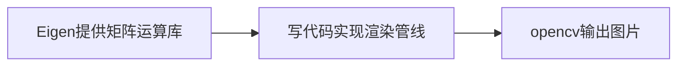

# 前言

本教程基于0.2分支撰写，预计之后会采用不同的库实现更复杂的功能，故在此时代码还不算庞大的情况下写下教程。
希望能让后人学习图形学时少跳点坑，同时方便自己复习基础知识。

# 思路

最初步的想法是受GAMES101课程框架的启发，但GAMES101的代码有些重，不适合用来从头开始手写软渲染器，因此代码有些地方借鉴GAMES101，有些地方通过个人理解，难免包含一些错误，希望后人在Issue中指正。
v0.1为一个milestone，至此一个十分简易的软渲染器完成了。实现整体思路为

v0.1和GAMES101一样，借用了Eigen和opencv库，但有一点，Eigen中提供了几何操作的API，opencv也有一套图形处理的gapi，在学习图形学知识造轮子的时候，有可能需要回避一部分API。

# 实现框架

本仓库采用的配置是cmake+MinGW/gcc。既然为了学习现代化计算机图形学，那么一定离不开cmake。cmake提供了跨平台的构建方案，不管是GLAD/openGL还是Eigen，opencv，都可以用cmake进行跨平台的设置。此外，由于持续集成在linux环境下跑，不得不选用cmake。如果是VS用户，也没关系，cmake可以自动生成VS project（只要你没改cmakelists）。
